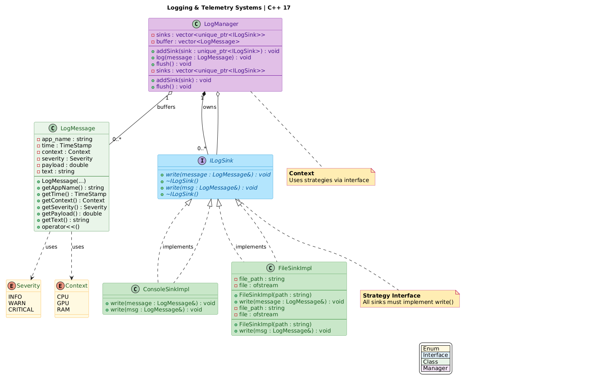

# Phase One Summary

---

## What I Built

A synchronous logging system with multiple output destinations.

---

## Core Components

| Component | Purpose |
|-----------|---------|
| `LogMessage` | Holds log data (app name, context, severity, payload, time, text) |
| `ILogSink` | Interface that defines write() contract |
| `ConsoleSinkImpl` | Writes logs to terminal |
| `FileSinkImpl` | Writes logs to file |
| `LogManager` | Coordinates everything, routes messages to all sinks |

---

## Key Decisions You Made

| Decision | Why |
|----------|-----|
| `enum class` for Severity and Context | Type safety, no implicit conversion |
| `std::unique_ptr` for sinks | Automatic memory management, clear ownership |
| `std::vector` for buffer and sinks | Dynamic storage for multiple items |
| `std::chrono` for time | Modern C++ time handling |
| Private helper functions | Encapsulation, hide implementation details |
| `const` references in getters | Efficient, no copying |
| `friend operator<<` | Enable `std::cout << msg` syntax |
| Strategy Pattern | Add new sinks without changing existing code |

---

## Data Flow

```
User creates LogMessage
        |
        v
LogManager.log(msg) --> stores in buffer
        |
        v
LogManager.flush() --> iterates all sinks
        |
        v
Each sink.write(msg) --> outputs to destination
```

---

## Severity Logic

```
payload <= 25  --> INFO
payload 26-74  --> WARN
payload >= 75  --> CRITICAL
```

---

## Output Format

```
[timestamp] [context] [app_name] [severity] Payload value is: X%
```

---

## C++ Concepts Applied

- Virtual functions and virtual destructors
- Pure virtual functions (`= 0`)
- Inheritance (`public ILogSink`)
- `override` keyword
- `= default` and `= delete`
- `std::move` for unique_ptr
- `const auto&` in range-based loops
- Initializer lists in constructors
- Operator overloading
- Namespaces

---

## Project Structure

```
project/
├── CMakeLists.txt          (root)
├── inc/logging/*.hpp       (headers)
├── src/logging/*.cpp       (implementations)
├── app/main.cpp            (executable)
└── test/phase1.cpp         (tests)
```

---

## Build Commands

```bash
cmake -S . -B build
cmake --build build
./build/app/logging_app
```

---

## Pattern Used: Strategy

```
LogManager knows: ILogSink (interface)
LogManager does NOT know: ConsoleSinkImpl, FileSinkImpl

Result: Add new sinks without changing LogManager


```

## Classes Diagram


