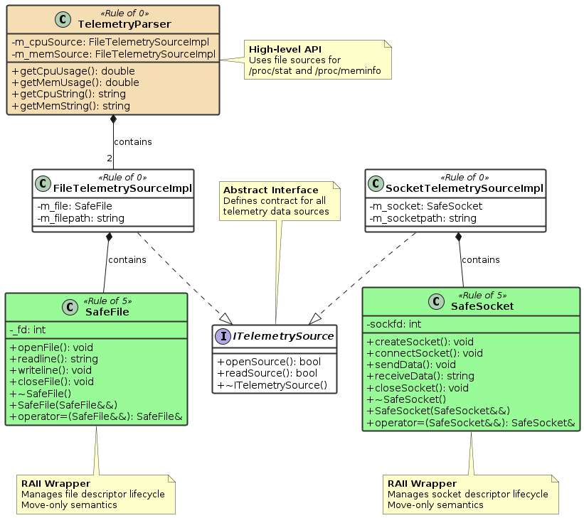

# Phase 2: Data Sources & Smart Resource Management

---

## What I Built

A data source system with smart resource management using RAII pattern, move semantics, and proper ownership handling.

---

## Core Components

| Component | Purpose | Rule |
|-----------|---------|------|
| `ITelemetrySource` | Interface for all data sources | Interface |
| `SafeFile` | RAII wrapper for POSIX file operations | Rule of 5 |
| `SafeSocket` | RAII wrapper for Unix Domain Socket operations | Rule of 5 |
| `FileTelemetrySourceImpl` | File-based telemetry source | Rule of 0 |
| `SocketTelemetrySourceImpl` | Socket-based telemetry source | Rule of 0 |
| `TelemetryParser` | Parses /proc/stat and /proc/meminfo | Rule of 0 |
| `LogMessage` (refactored) | All special members defaulted | Rule of 0 |

---

## Key Concepts Applied

| Concept | Where Applied |
|---------|---------------|
| RAII | SafeFile, SafeSocket |
| Rule of 5 | SafeFile, SafeSocket |
| Rule of 0 | FileTelemetrySourceImpl, SocketTelemetrySourceImpl, TelemetryParser |
| Move Semantics | SafeFile, SafeSocket |
| Deleted Copy | SafeFile, SafeSocket |
| Virtual Destructor | ITelemetrySource |
| Pure Virtual Functions | ITelemetrySource |

---

## Rule of 5 vs Rule of 0

```
┌─────────────────────────────────────────────────────────────────┐
│                                                                 │
│   RULE OF 5 (Manages raw resources)                             │
│   ─────────────────────────────────                             │
│   SafeFile, SafeSocket                                          │
│                                                                 │
│   ✅ ~Destructor()                                              │
│   ✅ Move constructor                                           │
│   ✅ Move assignment                                            │
│   ❌ Copy constructor = delete                                  │
│   ❌ Copy assignment = delete                                   │
│                                                                 │
├─────────────────────────────────────────────────────────────────┤
│                                                                 │
│   RULE OF 0 (Uses RAII members)                                 │
│   ─────────────────────────────                                 │
│   FileTelemetrySourceImpl, SocketTelemetrySourceImpl            │
│                                                                 │
│   No custom destructor                                          │
│   No custom copy/move operations                                │
│   Compiler generates everything!                                │
│                                                                 │
└─────────────────────────────────────────────────────────────────┘
```

---

## RAII Pattern

```
CONSTRUCTION              USAGE                   DESTRUCTION
     │                      │                          │
     ▼                      ▼                          ▼
┌──────────┐          ┌──────────┐              ┌──────────┐
│ Acquire  │          │   Use    │              │ Release  │
│ Resource │─────────►│ Resource │─────────────►│ Resource │
│ (open)   │          │ (read)   │              │ (close)  │
└──────────┘          └──────────┘              └──────────┘
                                                      │
                                    AUTOMATIC - guaranteed!
```

---

## Move Semantics Visualization

```
BEFORE MOVE:                    AFTER MOVE:
┌──────────┐                    ┌──────────┐
│  obj A   │                    │  obj A   │
│  fd = 5  │                    │  fd = -1 │  ← invalidated
└────┬─────┘                    └──────────┘
     │
     │ owns                     ┌──────────┐
     ▼                          │  obj B   │
┌──────────┐                    │  fd = 5  │  ← new owner
│   FILE   │                    └────┬─────┘
└──────────┘                         │ owns
                                     ▼
                                ┌──────────┐
                                │   FILE   │
                                └──────────┘
```

---

## Data Flow

```
┌─────────────────────────────────────────────────────────────────┐
│                         DATA FLOW                               │
├─────────────────────────────────────────────────────────────────┤
│                                                                 │
│   External Source                                               │
│   (File or Socket)                                              │
│         │                                                       │
│         ▼                                                       │
│   ┌─────────────┐                                               │
│   │ RAII Wrapper│  SafeFile / SafeSocket                        │
│   │ (Rule of 5) │  - Manages raw resource                       │
│   └──────┬──────┘  - Auto-cleanup guaranteed                    │
│          │                                                      │
│          ▼                                                      │
│   ┌─────────────┐                                               │
│   │ Telemetry   │  FileTelemetrySourceImpl /                    │
│   │ Source Impl │  SocketTelemetrySourceImpl                    │
│   │ (Rule of 0) │  - Implements ITelemetrySource                │
│   └──────┬──────┘  - No resource management code                │
│          │                                                      │
│          ▼                                                      │
│   ┌─────────────┐                                               │
│   │  Logging    │  LogManager from Phase 1                      │
│   │  System     │                                               │
│   └─────────────┘                                               │
│                                                                 │
└─────────────────────────────────────────────────────────────────┘
```

---

## Class Hierarchy

```
                        ITelemetrySource
                              ▲
                              │ implements
              ┌───────────────┴───────────────┐
              │                               │
   FileTelemetrySourceImpl         SocketTelemetrySourceImpl
              │                               │
              │ uses                          │ uses
              ▼                               ▼
          SafeFile                        SafeSocket
              │                               │
              │ wraps                         │ wraps
              ▼                               ▼
      POSIX File Ops                 Unix Domain Socket Ops
      (open/read/close)              (socket/connect/recv/close)
```

---

## Interface Definition

```cpp
class ITelemetrySource
{
public:
    virtual bool openSource() = 0;
    virtual bool readSource(std::string& out) = 0;
    virtual ~ITelemetrySource() = default;
};
```

---

## SafeFile Special Members

```cpp
// Rule of 5
SafeFile() = default;
~SafeFile();                                    // Closes file
SafeFile(SafeFile&& other) noexcept;            // Move constructor
SafeFile& operator=(SafeFile&& other) noexcept; // Move assignment
SafeFile(const SafeFile&) = delete;             // No copy
SafeFile& operator=(const SafeFile&) = delete;  // No copy
```

---

## SafeSocket Special Members

```cpp
// Rule of 5
SafeSocket() = default;
~SafeSocket();                                      // Closes socket
SafeSocket(SafeSocket&& other) noexcept;            // Move constructor
SafeSocket& operator=(SafeSocket&& other) noexcept; // Move assignment
SafeSocket(const SafeSocket&) = delete;             // No copy
SafeSocket& operator=(const SafeSocket&) = delete;  // No copy
```

---

## Implementation Classes (Rule of 0)

```cpp
class FileTelemetrySourceImpl : public ITelemetrySource
{
private:
    SafeFile m_file;        // RAII member handles cleanup
    std::string m_filepath;
    
    // NO special member functions!
    // Compiler generates all of them correctly
};
```

---

## POSIX File Operations Used

| Function | Header | Purpose |
|----------|--------|---------|
| `open()` | `<fcntl.h>` | Open file, get descriptor |
| `read()` | `<unistd.h>` | Read bytes from file |
| `write()` | `<unistd.h>` | Write bytes to file |
| `close()` | `<unistd.h>` | Close file descriptor |
| `lseek()` | `<unistd.h>` | Seek to position |

---

## Unix Domain Socket Operations Used

| Function | Header | Purpose |
|----------|--------|---------|
| `socket()` | `<sys/socket.h>` | Create socket |
| `connect()` | `<sys/socket.h>` | Connect to server |
| `send()` | `<sys/socket.h>` | Send data |
| `recv()` | `<sys/socket.h>` | Receive data |
| `close()` | `<unistd.h>` | Close socket |

---

## Bonus: TelemetryParser

```cpp
class TelemetryParser
{
private:
    FileTelemetrySourceImpl m_cpuSource;   // "/proc/stat"
    FileTelemetrySourceImpl m_memSource;   // "/proc/meminfo"
    
public:
    double getCpuUsage();      // Returns CPU usage %
    double getMemUsage();      // Returns Memory usage %
    std::string getCpuString(); // "CPU: 45.2%"
    std::string getMemString(); // "Memory: 62.8%"
};
```

---

## CPU Usage Calculation

```
/proc/stat format:
cpu  user nice system idle iowait irq softirq steal

Total = user + nice + system + idle + iowait + irq + softirq + steal
Idle  = idle + iowait

CPU Usage % = ((Total - Idle) / Total) * 100
```

---

## Memory Usage Calculation

```
/proc/meminfo format:
MemTotal:     8167344 kB
MemAvailable: 5765432 kB

Memory Usage % = ((MemTotal - MemAvailable) / MemTotal) * 100
```

---

## Project Structure

```
project/
├── CMakeLists.txt
├── inc/
│   ├── ITelemetrySource.hpp
│   ├── SafeFile.hpp
│   ├── SafeSocket.hpp
│   ├── FileTelemetrySourceImpl.hpp
│   ├── SocketTelemetrySourceImpl.hpp
│   ├── TelemetryParser.hpp
│   └── logging/
│       └── LogMessage.hpp (refactored)
├── src/
│   ├── SafeFile.cpp
│   ├── SafeSocket.cpp
│   ├── FileTelemetrySourceImpl.cpp
│   ├── SocketTelemetrySourceImpl.cpp
│   └── TelemetryParser.cpp
├── app/
│   └── main.cpp
└── test/
    └── phase2.cpp
```

---

## Build Commands

```bash
cmake -S . -B build
cmake --build build
./build/app/telemetry_app
```

---

## Example Usage

```cpp
#include "TelemetryParser.hpp"
#include <iostream>

int main()
{
    SmartDataHub::TelemetryParser parser;
    
    std::cout << parser.getCpuString() << std::endl;
    std::cout << parser.getMemString() << std::endl;
    
    return 0;
}
```

**Output:**
```
CPU: 12.5%
Memory: 45.3%
```

---

## Key Decisions Made

| Decision | Why |
|----------|-----|
| RAII for resource management | Guarantees cleanup, exception-safe |
| Rule of 5 for wrappers | Proper move semantics, no accidental copies |
| Rule of 0 for implementations | Leverage RAII, less code to maintain |
| Deleted copy operations | File descriptors can't be shared |
| `noexcept` on move operations | Enables STL container optimizations |
| Interface abstraction | Swap data sources without changing code |
| Composition over inheritance | FileTelemetrySourceImpl HAS-A SafeFile |

---

## C++ Concepts Applied

- RAII (Resource Acquisition Is Initialization)
- Move semantics (`std::move`, rvalue references)
- Rule of 5 / Rule of 0
- `= delete` for deleted functions
- `= default` for defaulted functions
- `noexcept` specifier
- Virtual functions and inheritance
- `override` keyword
- Initializer lists
- `const` correctness
- Smart composition with RAII members
- POSIX system calls
- Unix Domain Sockets (IPC)

---

## Pattern Used: Composition with RAII

```
FileTelemetrySourceImpl does NOT manage resources directly
FileTelemetrySourceImpl HAS-A SafeFile (which manages resources)

Result: Clean separation of concerns
        - SafeFile: resource management expert
        - FileTelemetrySourceImpl: business logic only
```


---

## Phase 2 Deliverables Checklist

| Deliverable | Status |
|-------------|--------|
| ITelemetrySource interface | ✅ |
| SafeFile (RAII, Rule of 5) | ✅ |
| SafeSocket (RAII, Rule of 5) | ✅ |
| FileTelemetrySourceImpl (Rule of 0) | ✅ |
| SocketTelemetrySourceImpl (Rule of 0) | ✅ |
| LogMessage refactored | ✅ |
| Bonus: Parse /proc/stat | ✅ |
| Bonus: Parse /proc/meminfo | ✅ |

---


## Phase 2 UML Diagram


