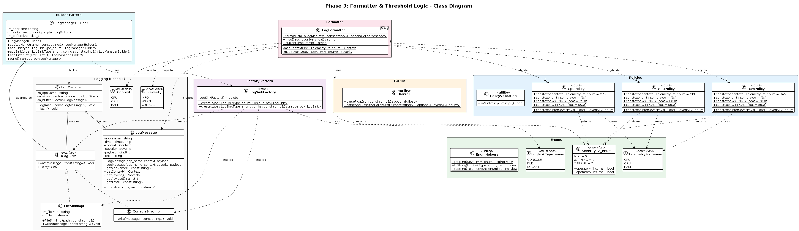

# Phase 3: Formatter & Threshold Logic

## Overview

Phase 3 implements a **policy-based formatter module** that converts raw telemetry data into structured log messages with automatic severity classification.

---

## Features

- ✅ Type-safe enumerations (`enum class`)
- ✅ Policy-based threshold configuration
- ✅ Compile-time severity inference (`constexpr`)
- ✅ Safe parsing with `std::optional`
- ✅ Factory pattern for sink creation
- ✅ Builder pattern for LogManager construction
- ✅ `magic_enum` integration for enum reflection

---

## Architecture

```
Raw Data → Parser → LogFormatter<Policy> → LogMessage → LogManager → Sinks
              │            │
              │            └── Uses Policy (CpuPolicy, GpuPolicy, RamPolicy)
              │
              └── Returns std::optional<float>
```

---

## Components

| Component | File | Description |
|-----------|------|-------------|
| Enums | `Enums.hpp` | `SeverityLvl_enum`, `LogSinkType_enum`, `TelemetrySrc_enum` |
| Policies | `Policies.hpp` | `CpuPolicy`, `GpuPolicy`, `RamPolicy` with thresholds |
| Parser | `Parser.hpp` | `parseFloat()`, `parseAndClassify<Policy>()` |
| LogFormatter | `LogFormatter.hpp` | Template class for formatting telemetry data |
| LogSinkFactory | `LogSinkFactory.hpp` | Factory pattern for creating sinks |
| LogManagerBuilder | `LogManagerBuilder.hpp` | Builder pattern for LogManager |

---

## Policies & Thresholds

| Policy | Source | WARNING | CRITICAL |
|--------|--------|---------|----------|
| `CpuPolicy` | CPU | > 75% | > 90% |
| `GpuPolicy` | GPU | > 80% | > 95% |
| `RamPolicy` | RAM | > 70% | > 85% |

**Severity Logic:**
```
value ≤ WARNING     → INFO
value > WARNING     → WARNING
value > CRITICAL    → CRITICAL
```

---

## Quick Start

### Basic Usage

```cpp
#include "LogFormatter.hpp"
#include "Policies.hpp"

using namespace logging;

int main() {
    // Format CPU telemetry data
    auto msg = LogFormatter<CpuPolicy>::formatDataToLogMsg("85.5");
    
    if (msg) {
        std::cout << *msg << std::endl;
    }
    
    return 0;
}
```

### Using Factory & Builder

```cpp
#include "LogManagerBuilder.hpp"
#include "LogFormatter.hpp"

using namespace logging;

int main() {
    // Build LogManager
    auto manager = LogManagerBuilder()
        .setAppName("MyApp")
        .addSink(LogSinkType_enum::CONSOLE)
        .addSink(LogSinkType_enum::FILE, "app.log")
        .build();
    
    // Format and log
    auto msg = LogFormatter<CpuPolicy>::formatDataToLogMsg("92.0");
    if (msg) {
        manager->log(*msg);
        manager->flush();
    }
    
    return 0;
}
```

---

## API Reference

### Parser

```cpp
// Parse string to float
std::optional<float> parseFloat(const std::string& str);

// Parse and get severity using policy
template<typename Policy>
std::optional<SeverityLvl_enum> parseAndClassify(const std::string& str);
```

### LogFormatter

```cpp
template<typename Policy>
class LogFormatter {
    static std::optional<LogMessage> formatDataToLogMsg(const std::string& raw);
    static std::string msgDescription(float val);
    static std::string currentTimeStamp();
};
```

### LogSinkFactory

```cpp
class LogSinkFactory {
    static std::unique_ptr<ILogSink> create(LogSinkType_enum type);
    static std::unique_ptr<ILogSink> create(LogSinkType_enum type, 
                                            const std::string& config);
};
```

### LogManagerBuilder

```cpp
class LogManagerBuilder {
    LogManagerBuilder& setAppName(const std::string& name);
    LogManagerBuilder& addSink(LogSinkType_enum type);
    LogManagerBuilder& addSink(LogSinkType_enum type, const std::string& config);
    LogManagerBuilder& setBufferSize(size_t size);
    std::unique_ptr<LogManager> build();
};
```

---

## File Structure

```
inc/
├── Formatter/
│   ├── Enums.hpp
│   ├── Policies.hpp
│   ├── Parser.hpp
│   ├── LogFormatter.hpp
│   ├── LogSinkFactory.hpp
│   └── LogManagerBuilder.hpp
└── logging/
    └── LogMessage.hpp (updated)

tests/phase3/
├── EnumsTest.cpp
├── PoliciesTest.cpp
├── ParserTest.cpp
├── LogFormatterTest.cpp
├── LogSinkFactoryTest.cpp
└── LogManagerBuilderTest.cpp
```

---

## Building

```bash
# Build
bazel build //app/phase3:phase3_app

# Run
bazel run //app/phase3:phase3_app
```

## Testing

```bash
# Run all tests
bazel test //tests/phase3:phase3_tests

# Run specific test
bazel test //tests/phase3:log_formatter_test

# Verbose output
bazel test //tests/phase3:phase3_tests --test_output=all
```

---

## Dependencies

| Dependency | Purpose |
|------------|---------|
| C++17 | `std::optional`, `std::string_view`, `if constexpr` |
| magic_enum | Enum-to-string conversion |
| Google Test | Unit testing |

---

## Design Patterns Used

### 1. Policy-Based Design (Strategy)
Different threshold configurations without code changes.

### 2. Factory Pattern
Encapsulates sink object creation.

### 3. Builder Pattern
Step-by-step LogManager construction with fluent interface.

---

## Example Output

```
[2024-01-15 14:32:45] [CPU] [TelemetryApp] [INFO] Payload value is: 50%
[2024-01-15 14:32:45] [CPU] [TelemetryApp] [WARN] Payload value is: 80%
[2024-01-15 14:32:45] [CPU] [TelemetryApp] [CRITICAL] Payload value is: 95%
```

---

## Changes from Phase 1/2

| Component | Change |
|-----------|--------|
| `LogMessage` | Added constructor accepting `Severity` parameter |
| Enums | New `SeverityLvl_enum`, `LogSinkType_enum`, `TelemetrySrc_enum` |
| New Files | `Policies.hpp`, `Parser.hpp`, `LogFormatter.hpp`, `LogSinkFactory.hpp`, `LogManagerBuilder.hpp` |

---
## UML Diagram

