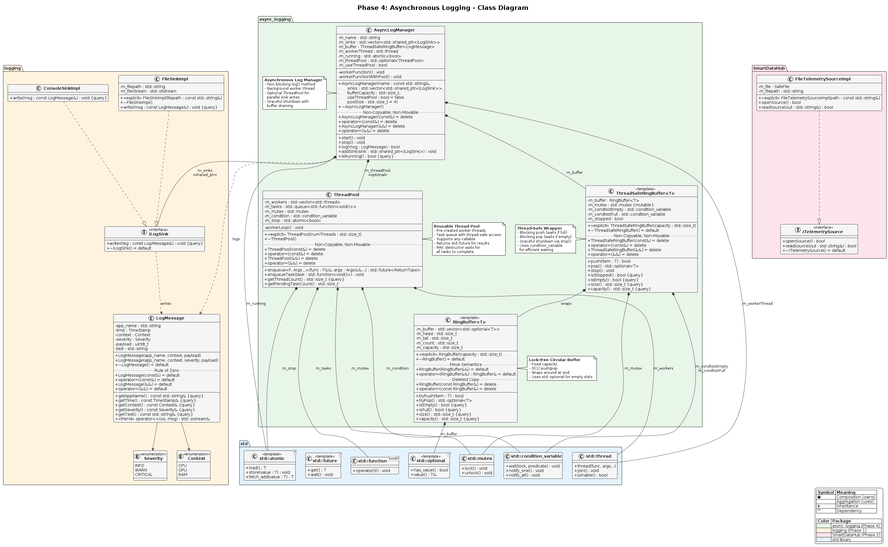

# Phase 4: Asynchronous Logging

## Overview

Phase 4 transforms the synchronous logging system into a high-performance asynchronous logging framework using multithreading, thread-safe data structures, and a thread pool for parallel sink operations.

---

## Goals

- Refactor the logging logic to utilize threads for better performance
- Implement thread-safe data structures for concurrent access
- Create a reusable ThreadPool for parallel task execution
- Integrate asynchronous logging with telemetry sources

---

## Architecture

```
┌──────────────────────────────────────────────────────────────────────────────┐
│                    ASYNC TELEMETRY LOGGER WITH THREADPOOL                    │
│                                                                              │
│   ┌───────────────┐   ┌───────────────┐   ┌───────────────┐                  │
│   │ CPU_Monitor   │   │ RAM_Monitor   │   │ GPU_Monitor   │  PRODUCER        │
│   │   Thread      │   │   Thread      │   │   Thread      │  THREADS         │
│   └───────┬───────┘   └───────┬───────┘   └───────┬───────┘                  │
│           │                   │                   │                          │
│           └───────────────────┼───────────────────┘                          │
│                               │ log(msg)                                     │
│                               ▼                                              │
│           ┌───────────────────────────────────────────┐                      │
│           │         ThreadSafeRingBuffer              │                      │
│           │   ┌─────────────────────────────────┐     │                      │
│           │   │  mutex + condition_variables    │     │                      │
│           │   └─────────────────────────────────┘     │                      │
│           │   ┌─────────────────────────────────┐     │                      │
│           │   │  RingBuffer [msg][msg][msg]...  │     │                      │
│           │   └─────────────────────────────────┘     │                      │
│           └───────────────────┬───────────────────────┘                      │
│                               │ pop()                                        │
│                               ▼                                              │
│           ┌───────────────────────────────────────────┐                      │
│           │         Worker Thread                     │                      │
│           │   for each sink:                          │                      │
│           │       threadPool.enqueue(sink->write)     │                      │
│           └───────────────────┬───────────────────────┘                      │
│                               │                                              │
│                               ▼                                              │
│           ┌───────────────────────────────────────────┐                      │
│           │            ThreadPool (4 threads)         │                      │
│           │   ┌─────────┐ ┌─────────┐ ┌─────────┐     │                      │
│           │   │Worker 1 │ │Worker 2 │ │Worker 3 │ ... │                      │
│           │   └────┬────┘ └────┬────┘ └────┬────┘     │                      │
│           └────────┼──────────┼───────────┼──────────┘                      │
│                    │          │           │                                  │
│              ┌─────▼────┐ ┌───▼─────┐ ┌───▼─────┐                            │
│              │Console   │ │ File    │ │ Socket  │  SINKS                     │
│              │ Sink     │ │ Sink    │ │ Sink    │                            │
│              └──────────┘ └─────────┘ └─────────┘                            │
│                                                                              │
└──────────────────────────────────────────────────────────────────────────────┘
```

---

## Topics Covered

### C++ Concepts

| Concept | Description | Usage |
|---------|-------------|-------|
| **Callables** | Functors, lambdas, `std::function` | Task encapsulation in ThreadPool |
| **`std::thread`** | Thread creation and management | Worker threads, telemetry readers |
| **`std::mutex`** | Mutual exclusion for shared data | Protecting RingBuffer access |
| **`std::lock_guard`** | RAII-style mutex locking | Simple lock/unlock scenarios |
| **`std::unique_lock`** | Flexible mutex locking | Required for condition_variable |
| **`std::condition_variable`** | Thread synchronization | Wait/notify for buffer state |
| **`std::atomic`** | Lock-free thread-safe variables | Stop flags, counters |
| **`std::future`/`std::promise`** | Asynchronous return values | ThreadPool task results |
| **`std::packaged_task`** | Wrapper for callable with future | ThreadPool enqueue |

### Design Patterns

| Pattern | Description | Implementation |
|---------|-------------|----------------|
| **Producer-Consumer** | Decouples data production from consumption | Telemetry threads → RingBuffer → Worker thread |
| **Thread Pool** | Reuses threads for multiple tasks | `ThreadPool` class with task queue |
| **RAII** | Resource management tied to object lifetime | `lock_guard`, `unique_lock` |

---

## Components

### 1. RingBuffer<T>

A fixed-size circular buffer template class.

**Features:**
- O(1) push and pop operations
- Wraps around when reaching capacity
- Uses `std::optional<T>` for empty slot representation
- Supports move semantics, no copy semantics

**Key Methods:**
```cpp
bool tryPush(T item);           // Returns false if full
std::optional<T> tryPop();      // Returns nullopt if empty
bool isEmpty() const;
bool isFull() const;
std::size_t size() const;
std::size_t capacity() const;
```

**File:** `inc/AsyncLogging/RingBuffer.hpp`

---

### 2. ThreadSafeRingBuffer<T>

Thread-safe wrapper around RingBuffer using mutex and condition variables.

**Features:**
- Blocking push (waits if buffer full)
- Blocking pop (waits if buffer empty)
- Graceful shutdown via `stop()` method
- Uses `std::condition_variable` for efficient waiting

**Key Methods:**
```cpp
bool push(T item);              // Blocks until space available or stopped
std::optional<T> pop();         // Blocks until data available or stopped
void stop();                    // Signals all waiting threads to exit
bool isStopped() const;
```

**Synchronization:**
- `m_mutex` - protects buffer access
- `m_condNotEmpty` - signals when data is available
- `m_condNotFull` - signals when space is available

**File:** `inc/AsyncLogging/ThreadSafeRingBuffer.hpp`

---

### 3. ThreadPool

A reusable thread pool for parallel task execution.

**Features:**
- Pre-created worker threads
- Task queue with thread-safe access
- Supports any callable (functions, lambdas, functors)
- Returns `std::future` for task results

**Key Methods:**
```cpp
explicit ThreadPool(std::size_t numThreads);

// Enqueue with return value
template <typename F, typename... Args>
auto enqueue(F&& func, Args&&... args) -> std::future<decltype(func(args...))>;

// Simple enqueue for void() tasks
void enqueueTask(std::function<void()> task);

std::size_t getThreadCount() const;
std::size_t getPendingTaskCount();
```

**Files:**
- `inc/AsyncLogging/ThreadPool.hpp`
- `src/AsyncLogging/ThreadPool.cpp`

---

### 4. AsyncLogManager

Asynchronous log manager with optional ThreadPool support.

**Features:**
- Non-blocking `log()` method
- Background worker thread for sink operations
- Optional ThreadPool for parallel sink writes
- Graceful shutdown with buffer draining

**Key Methods:**
```cpp
AsyncLogManager(const std::string& name,
                std::vector<std::shared_ptr<ILogSink>> sinks,
                std::size_t bufferCapacity,
                bool useThreadPool = false,
                std::size_t poolSize = 4);

void start();                   // Start background worker
void stop();                    // Stop and drain buffer
bool log(LogMessage msg);       // Non-blocking log
void addSink(std::shared_ptr<ILogSink> sink);
bool isRunning() const;
```

**Files:**
- `inc/AsyncLogging/AsyncLogManager.hpp`
- `src/AsyncLogging/AsyncLogManager.cpp`

---

## Synchronous vs Asynchronous Logging

### Synchronous (Before)

```
Main Thread:
    log(msg) → write to console → write to file → return
                     ↓                  ↓
                  BLOCKED            BLOCKED
```

**Problems:**
- Main thread waits for I/O
- High latency for logging operations
- Poor performance under high load

### Asynchronous (After)

```
Main Thread:              Background Thread:
    log(msg) → push to buffer → return immediately
                     ↓
              ThreadSafeRingBuffer
                     ↓
              pop → write to sinks (parallel via ThreadPool)
```

**Benefits:**
- Main thread never blocks on I/O
- Low latency for logging calls
- High throughput under load
- Parallel sink writes with ThreadPool

---

## File Structure

```
inc/AsyncLogging/
├── BUILD
├── RingBuffer.hpp
├── ThreadSafeRingBuffer.hpp
├── ThreadPool.hpp
└── AsyncLogManager.hpp

src/AsyncLogging/
├── AsyncLogManager.cpp
└── ThreadPool.cpp

app/phase4/
├── BUILD
├── generate_telemetry.sh
├── test_threadsafe_buffer.cpp
├── test_thread_pool.cpp
├── test_async_log_manager.cpp
└── main.cpp

Utest/phase4/
├── BUILD
├── RingBufferTest.cpp
├── ThreadSafeRingBufferTest.cpp
├── ThreadPoolTest.cpp
└── AsyncLogManagerTest.cpp
```

---

## Build & Run

### Build All Phase 4 Targets

```bash
bazel build //app/phase4:...
```

### Run Tests

```bash
# Unit tests
bazel test //Utest/phase4:...

# Integration tests
bazel run //app/phase4:test_threadsafe_buffer
bazel run //app/phase4:test_thread_pool
bazel run //app/phase4:test_async_log_manager
```

### Run Main Application

```bash
# Terminal 1: Start telemetry generator
./app/phase4/generate_telemetry.sh

# Terminal 2: Run application
bazel run //app/phase4:main
```

---

## Key Learnings

1. **Thread Safety**: Shared data must be protected with mutexes
2. **Condition Variables**: Efficient alternative to busy-waiting
3. **RAII Locking**: `lock_guard` and `unique_lock` prevent deadlocks
4. **Producer-Consumer**: Decouples components for better performance
5. **Thread Pools**: Reusing threads is more efficient than creating new ones
6. **Graceful Shutdown**: Always provide a way to stop threads cleanly

---

## Deliverables Checklist

| Deliverable | Status |
|-------------|--------|
| RingBuffer template class | ✅ |
| Move semantics support | ✅ |
| No copy semantics | ✅ |
| `std::optional<T>` wrapper | ✅ |
| `tryPush` / `tryPop` methods | ✅ |
| Refactor LogManager with RingBuffer | ✅ |
| Refactor with `std::threads` | ✅ |
| **MEGA BONUS: ThreadPool** | ✅ |

---
## UML Diagram

