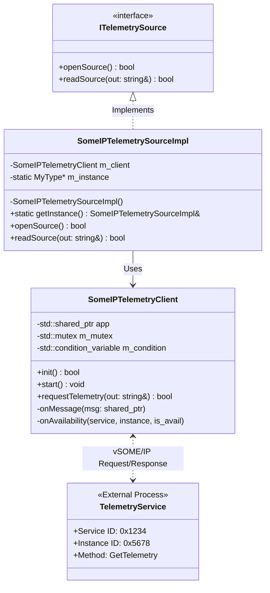
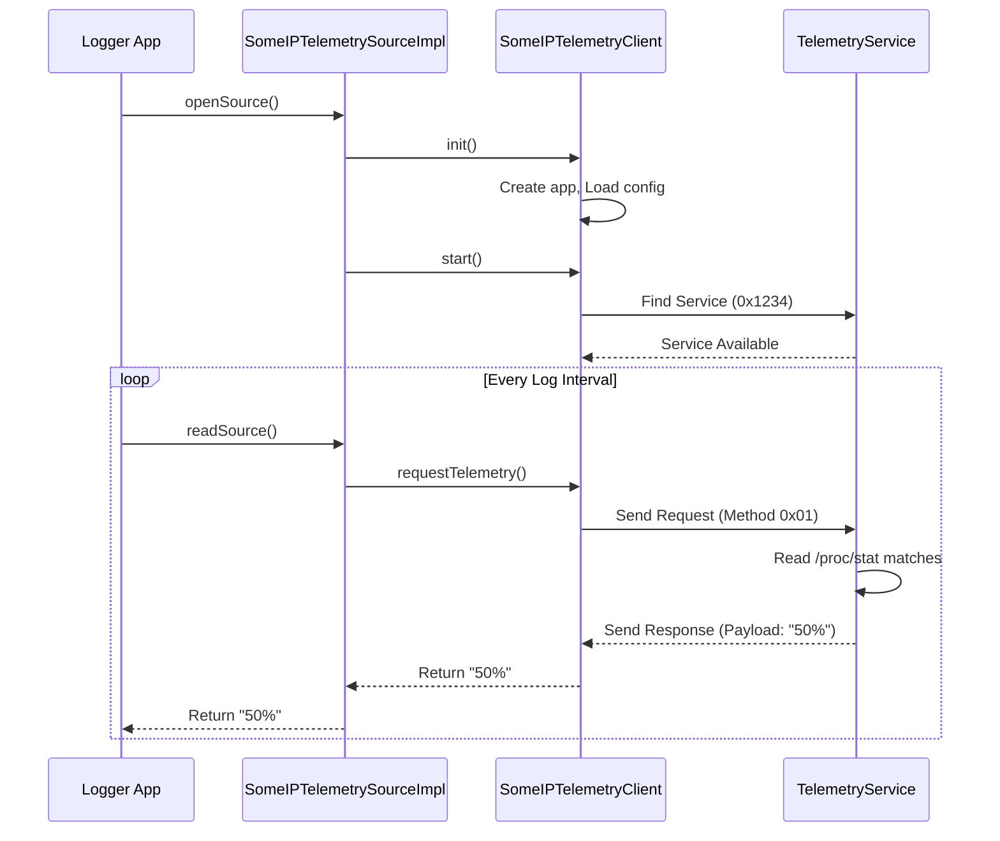

# Phase 5: Telemetry Over Network (vSOME/IP)

## Overview
Phase 5 introduces network-based telemetry data acquisition using the **vSOME/IP** (Scalable service-Oriented MiddlewarE over IP) protocol. This allows the logging system to receive data from remote or decoupled local services, simulating a real-world automotive environment where sensors and ECUs communicate over Ethernet.

## Key Components

1.  **Telemetry Service (Server)**:
    *   A vSOME/IP service (`0x1234`) that reads real system CPU usage from `/proc/stat`.
    *   Responds to client requests with the usage percentage (0-100%).

2.  **SomeIPTelemetryClient**:
    *   A low-level wrapper around the `vsomeip` library.
    *   Handles application initialization, service discovery, payload serialization, and request/response correlation.

3.  **SomeIPTelemetrySourceImpl**:
    *   **Adapter Pattern**: Adapts the `SomeIPTelemetryClient` to the project's standard `ITelemetrySource` interface.
    *   **Singleton Pattern**: Ensures only one instance of the vSOME/IP application exists, as required by the middleware.

## Architecture & UML

The following diagram illustrates the interaction between the Service, the Client Adapter, and the core Logging System.



### Communication Flow (Sequence Diagram)



## Implementation Deep Dive

### 1. The Singleton Adapter (`SomeIPTelemetrySourceImpl`)
We used the **Singleton Pattern** because the `vsomeip` middleware allows only **one application instance per process**. If we tried to create multiple clients (e.g., one for CPU, one for RAM), the application would crash.

```cpp
// Meyer's Singleton Implementation
static SomeIPTelemetrySourceImpl& getInstance() {
    static SomeIPTelemetrySourceImpl instance; // Created once
    return instance;
}
```

### 2. The vSOME/IP Client (`SomeIPTelemetryClient`)
This class handles the asynchronous nature of network communication. It uses a **Request/Response** pattern:
1.  **Request**: We send a message with `method_id = 0x0001`.
2.  **Blocking Wait**: We use `std::condition_variable` to wait for the response (simulating a synchronous read for the logger).
3.  **Response**: When `onMessage` is triggered by vsomeip, we notify the waiting thread.

## Configuration

Two JSON configuration files are required for the vSOME/IP runtime:

*   **`vsomeip_service.json`**: Configures the server (Service ID 0x1234).
*   **`vsomeip_client.json`**: Configures the client application.

## How to Run

1.  **Start the Service:**
    ```bash
    VSOMEIP_CONFIGURATION=app/phase5/vsomeip_service.json ./bazel-bin/app/phase5/telemetry_service
    ```

2.  **Start the Client/Main App:**
    ```bash
    VSOMEIP_CONFIGURATION=app/phase5/vsomeip_client.json ./bazel-bin/app/phase5/main
    ```
