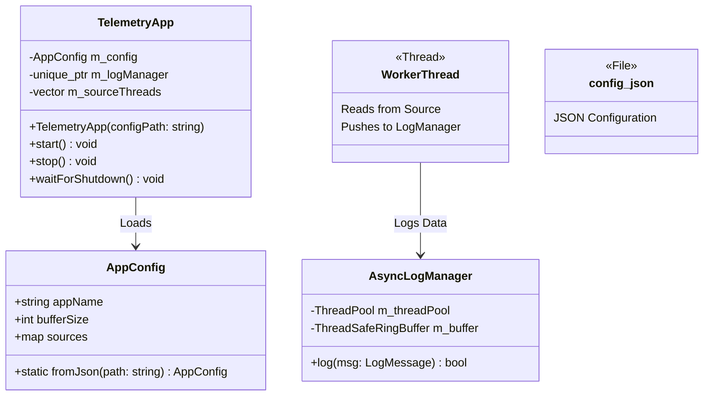
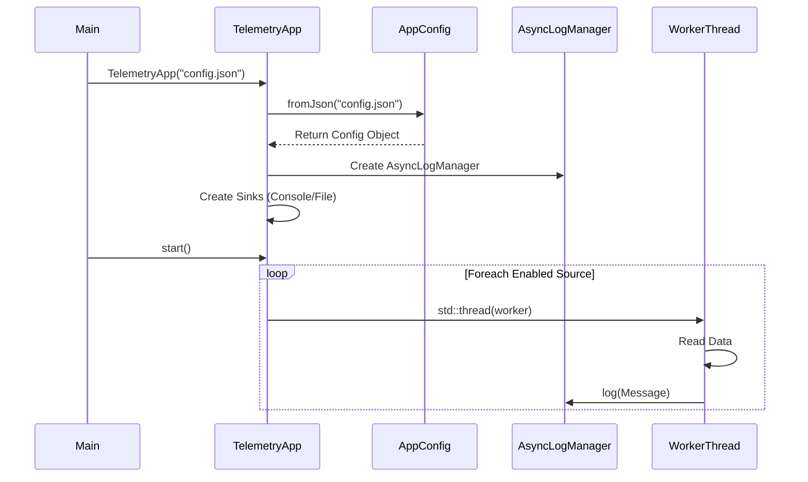

# Phase 6: System Wrap Up (Façade & Configuration)

## Overview
Phase 6 brings the entire logging system together into a cohesive, user-friendly package. The goal was to hide the implementation details of the diverse logging subsystems (file IO, threading, ring buffers, network sockets) behind a single, simple interface. This is achieved using the **Façade Design Pattern** and is enhanced by a powerful **JSON Configuration** system.

## Key Features

1.  **Façade Pattern (`TelemetryApp`)**:
    *   Unified entry point for the application.
    *   Hides complex initialization logic (sinks, sources, managers, threads).
    *   Provides simple `start()` and `stop()` methods.

2.  **Runtime Configuration (JSON)**:
    *   Uses **nlohmann/json** library.
    *   Enables/disables telemetry sources (CPU, RAM, GPU) dynamically.
    *   Configures logging rates and output destinations (Console, File) without recompiling.

3.  **AppConfig Structure**:
    *   Maps JSON data to strongly-typed C++ structures (`SourceConfig`, `AppConfig`).

## Architecture & UML

The Façade manages the lifecycle of the AsyncLogManager and multiple Source Workers, all driven by the configuration.



### System Startup Flow (Sequence Diagram)



## Implementation Deep Dive

### 1. The Façade (`TelemetryApp`)
This class creates a **unified interface** for the entire system. Instead of the user manually linking 10 different components, the `TelemetryApp` does it internally based on the configuration.

```cpp
// 3 Lines of Code to Run the specific configuration!
TelemetryApp app("config.json");
app.start();
app.waitForShutdown();
```

### 2. Runtime Configuration (`AppConfig`)
We used `nlohmann/json` to map JSON objects to C++ structs. This allows changing behavior without recompiling.

*   **Flexible Source Control**: We can turn sources on/off.
*   **Dynamic Sinks**: Each source can log to different sinks (e.g., CPU -> Console, GPU -> File).
*   **Rate Control**: We can adjust the `parseRateMs` to control how often we read data.

```cpp
// Example of Config Mapping
if (json.contains("sources")) {
    for (auto& [key, val] : json["sources"].items()) {
        SourceConfig conf;
        conf.enabled = val.value("enabled", false);
        // ...
    }
}
```

## Example Configuration (`config.json`)

```json
{
    "appName": "TelemetryLogger",
    "sources": {
        "CPU": {
            "enabled": true,
            "type": "FILE",
            "path": "/proc/stat",
            "parseRateMs": 500,
            "sinks": ["CONSOLE", "FILE"]
        },
        "GPU": {
            "enabled": false
        }
    }
}
```

## How to Run

```bash
# Build
bazel build //app/phase6:main

# Run with config
./bazel-bin/app/phase6/main app/phase6/config.json
```
